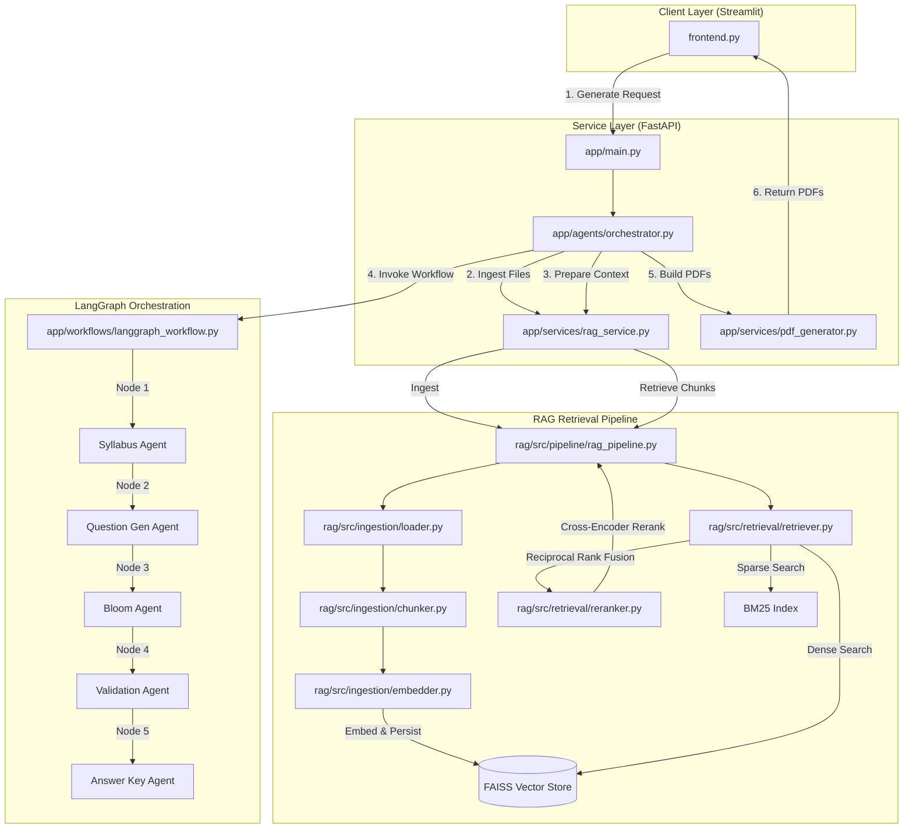
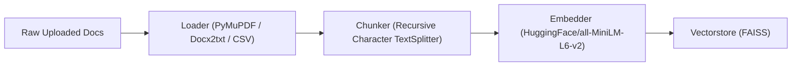
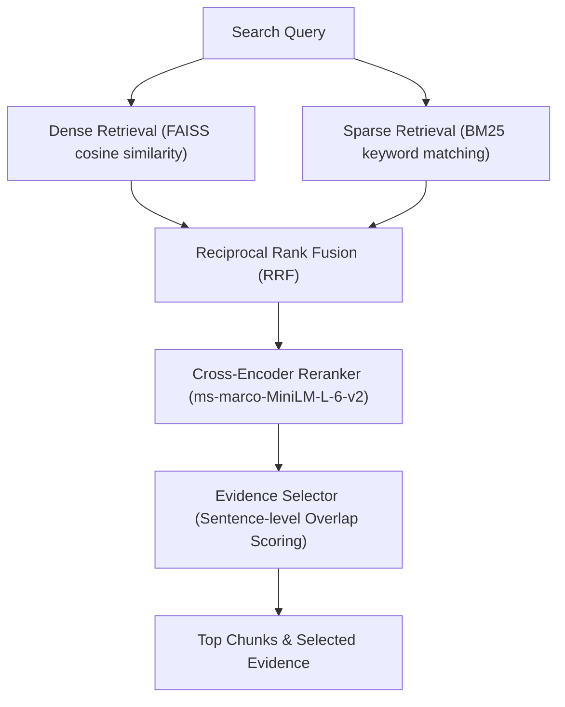

# Agentic AI Question Paper Generator: System Architecture & Data Flow

This document provides a comprehensive technical breakdown of the **Agentic AI Question Paper Generator**. It explains how the hybrid Retrieval-Augmented Generation (RAG) system, multi-agent LangGraph workflow, and FastAPI backend collaborate to produce university-level exam papers and answer keys.

---

## 1. System Architecture Overview

The application is structured into three primary layers:
1. **Frontend (Streamlit)**: A premium, dark/light theme user interface (`frontend.py`) for file upload, configuration input, and PDF download.
2. **Backend (FastAPI)**: Web server (`app/main.py`) exposing APIs and coordinating execution.
3. **Agentic RAG Engine**:
   - **LangGraph Orchestrator (`app/workflows/langgraph_workflow.py`)**: Coordinates the sequential execution of five specialized agent nodes.
   - **FAISS Hybrid RAG (`rag/src/`)**: Ingests, indexes, and retrieves grounded context from syllabus and textbook files.

### Overall Architecture Diagram



---

## 2. End-to-End Execution Flow

Here is the exact step-by-step lifecycle of a question paper generation request:

1. **User Action**: The user uploads files (PDF, DOCX, TXT) and specifies targets (total marks, question constraints, difficulty splits) on the Streamlit dashboard, clicking **Generate Question Paper**.
2. **FastAPI Request Processing**: FastAPI receives the file payload and arguments. The `Orchestrator` validates the configuration:
   - Evaluates that total marks equal the computed sum: $(2M \times \text{count}) + (5M \times \text{count}) + (10M \times \text{count}) + (15M \times \text{count}) = \text{total\_marks}$.
   - Verifies difficulty percentages sum to exactly $100\%$.
3. **RAG Ingestion**: The orchestrator triggers `RAGService.ingest_files()`. This wipes any existing vector index (to avoid leaking data from previous uploads) and chunks and embeds the new syllabus/course document.
4. **Context Preparation**: The RAG pipeline runs two specialized semantic queries against the index:
   - **Syllabus Retrieval**: Finds content related to units, learning objectives, and curriculum mapping.
   - **Content Retrieval**: Finds topics, definitions, and theory content.
   These retrieved chunks are formatted into plain text contexts and assigned to the LangGraph `AgentState`.
5. **Workflow Execution**: The orchestrator invokes the LangGraph compiled state graph using the prepared initial state. The agents process the state sequentially.
6. **PDF Generation**: If the status returned by LangGraph is not `failed`, the `PDFGenerator` generates two PDFs using ReportLab:
   - `question_paper_{timestamp}.pdf`
   - `answer_key_{timestamp}.pdf`
7. **Response & Display**: The file paths are returned to the client, allowing the user to download the generated PDFs.

---

## 3. How the RAG Pipeline Works

The RAG system in the `rag/` folder implements a complete chunking, indexing, and retrieval workflow tailored for academic documents.



### A. Document Loading (`rag/src/ingestion/loader.py`)
- The pipeline determines the loader class based on the file extension (`LOADER_MAP`):
  - `.pdf` $\rightarrow$ `PyMuPDFLoader` (provides fast and accurate bounding text retrieval)
  - `.docx`, `.doc` $\rightarrow$ `Docx2txtLoader`
  - `.txt` $\rightarrow$ `TextLoader`
  - `.pptx` $\rightarrow$ `UnstructuredPowerPointLoader`
  - `.xlsx`, `.xls` $\rightarrow$ `UnstructuredExcelLoader`
  - `.csv` $\rightarrow$ `CSVLoader`
- It converts the raw documents into LangChain `Document` schemas, attaching core metadata (source path, file type).

### B. Smart Chunking (`rag/src/ingestion/chunker.py`)
- Long files are divided into manageable fragments using `RecursiveCharacterTextSplitter`.
- **Chunk Parameters**:
  - `CHUNK_SIZE` = `512` characters
  - `CHUNK_OVERLAP` = `50` characters
- **Splitter Separators**: Ordered hierarchically to keep paragraphs and sentences whole where possible:
  `["\n\n\n", "\n\n", "\n", ". ", "! ", "? ", "; ", ", ", " ", ""]`
- **Metadata Enrichment**: Each chunk is annotated with `chunk_id`, `chunk_length`, and `first_line` (the first 120 characters, useful for debugging contexts).

### C. Embedding & Persistence (`rag/src/ingestion/embedder.py`)
- **Embedding Model**: `sentence-transformers/all-MiniLM-L6-v2` (384-dimensional dense vectors).
- **Vector Store**: `FAISS` is built in-memory and written locally to `vectorstore/faiss_index/`.
- **HuggingFace Fallback**: If HuggingFace dependencies are not installed or fail, a **`DummyVectorStore`** is automatically loaded:
  - Generates token sets from word splits.
  - Scores similarities based on word-overlap ratios ($\frac{|Q \cap D|}{1 + |D|}$).
  - Allows the system to remain functional and testable without heavy HuggingFace environments.

---

## 4. How Context Retrieval Takes Place

Retrieving raw vector database scores is often insufficient for academic questions. The system solves this by implementing **Hybrid Retrieval**, **Rank Fusion**, **Reranking**, and **Evidence Filtering**.



### A. Hybrid Dense-Sparse Retrieval (`rag/src/retrieval/retriever.py`)
- **Dense Path**: Query is embedded and matched via FAISS cosine similarity to extract semantic meanings.
- **Sparse Path**: Query is tokenized and matched using a `BM25Okapi` sparse index built on document word statistics (critical for finding specific terminology, course codes, and unit headers).

### B. Reciprocal Rank Fusion (RRF)
- Dense and sparse results are merged. For each document $d$:
  $$RRF(d) = \sum_{m \in \{dense, sparse\}} \frac{1}{k + rank_m(d)}$$
  *(where constant $k = 60$)*.
- Documents that score high on *both* metrics rise to the top, balancing semantic context and precise keyword alignment.

### C. Cross-Encoder Reranking (`rag/src/retrieval/reranker.py`)
- Fused candidate documents are scored using a Cross-Encoder transformer model (`cross-encoder/ms-marco-MiniLM-L-6-v2`).
- A cross-encoder performs joint self-attention over the query and document tokens simultaneously, yielding highly accurate relevance scores.
- Documents are sorted by cross-encoder score and sliced to `RERANK_TOP_N`.
- *Fallback*: If `sentence_transformers` is unavailable, a no-op fallback passes through the top $N$ RRF results.

### D. Evidence Selection & Formatting (`rag/src/generation/context_builder.py`)
- The pipeline selects the most relevant individual sentences from the top retrieved chunks.
- **Sentence Scoring**:
  - Scores sentences based on token overlap (excluding standard stopwords).
  - Multiplies score weighting for numeric matches (e.g., matching a unit number or key statistic).
  - Adds a bias (+0.5) for structural academic keywords (`"unit"`, `"module"`, `"topic"`, `"syllabus"`).
- Selects the top $3 - 5$ sentences as highly specific ground evidence to include in LLM generation prompts, reducing context window clutter and LLM hallucinations.

---

## 5. The LangGraph Agentic Pipeline

The compiled state graph (`app/workflows/langgraph_workflow.py`) processes the `AgentState` in a linear workflow with conditional routing.

```
START ──> SyllabusAgent ──> QuestionGeneratorAgent ──> BloomAgent ──> ValidationAgent ──> AnswerKeyAgent ──> END
                 │                      │                  │                 │                  │
                 └────────[If Status == "failed", route to END early]────────┴──────────────────┘
```

If any agent encounters a critical failure (e.g., API issues, validation errors), it updates the state status to `"failed"`. The conditional edge routing evaluates this status and immediately halts execution at the next node boundary, preventing cascading failures.

### Agent Node Responsibilities

#### 1. Syllabus Agent (`app/agents/syllabus_agent.py`)
- **Goal**: Extracts a clean list of units and sub-topics from syllabus context.
- **System Prompt**: Curtails curatorial noise (page numbers, textbook names). Normalizes unit names (e.g., "UNIT I", "Module 1" $\rightarrow$ `Unit 1`).
- **Validation**: Ensures every unit has a numeric `unit_number` and a list of specific sub-topics.

#### 2. Question Generator Agent (`app/agents/question_generator_agent.py`)
- **Goal**: Formulates exam questions conforming to the requested distribution.
- **Constraints**: Generates exactly the requested number of questions for each marks category ($2M$ short, $5M$ brief, $10M$ long, $15M$ essay) and satisfies the target difficulty ratios (easy/medium/hard).
- **Grounding**: Adheres strictly to the RAG content context to prevent hallucinations.
- **Correction**: If the model outputs mismatched question types for specific mark weights, the agent auto-corrects them (e.g., $2M \rightarrow$ `"short"`, $10M \rightarrow$ `"long"`).

#### 3. Bloom Taxonomy Agent (`app/agents/bloom_agent.py`)
- **Goal**: Analyzes and classifies cognitive categories for each generated question.
- **Levels**: Maps questions to the 6 Bloom's levels: *Remember, Understand, Apply, Analyze, Evaluate, Create*.
- **Recovery**: If the LLM omits required fields in the JSON report, the agent automatically restores the missing values using metadata from the original generated questions.

#### 4. Validation Agent (`app/agents/validation_agent.py`)
- **Goal**: Performs quality assurance on the complete question list.
- **Evaluation Criteria**:
  1. Semantic duplicates or overlapping concepts.
  2. Proportional syllabus topic coverage.
  3. Strict content grounding (flags ungrounded topics).
  4. Cognitive level distribution (requires spanning $\ge 4$ Bloom levels).
- **Self-Correction**: If issues are found, it sets `is_valid` to `False` and provides corrected or replacement questions in the response schema.

#### 5. Answer Key Agent (`app/agents/answerkey_agent.py`)
- **Goal**: Generates model answers, grading schemas, and marking criteria.
- **Answers**: Answers are grounded directly in the RAG textbook/content chunks.
- **Marking Key**: Provides an itemized marking breakdown (e.g., "3 marks for drawing the flowchart, 4 marks for explanation, 3 marks for writing the pseudocode").

---

## 6. Configured Prompts & System Rules

All agents enforce strict output schemas through **system prompts** (`app/prompts/`):
- **JSON Enforcements**: System instructions require returning **ONLY** a valid JSON array or object, completely stripped of conversational markdown wrappers.
- **Wrapper Stripping**: The `LLMService` automatically sanitizes response bodies by stripping markdown code block fences (e.g., ```json ... ```) before parsing.
- **Groq API Connection**: Connects to Groq using the configured model (default: `llama-3.3-70b-versatile`) with centralized exception handlers and exponential backoff retries.
